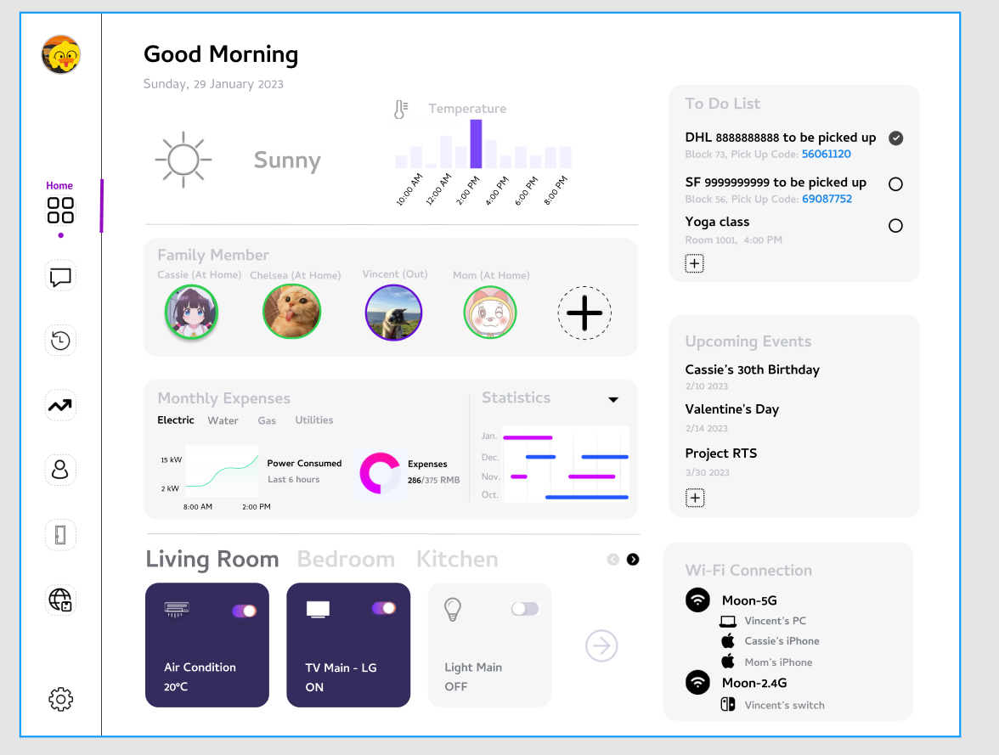

# Home-Assistant

Digital Home Assistant. A simple web application that can help manage a lot of personal & family stuff.

## Gallery

> Final release may differ from the prototype below.

## Plan Of Record (POR) Features

The purpose of this document mainly describes the POR features with the latest version of Digital Home Assistant in this repository. This POR scetion is expected to be updated regularly to reflect the web application implimentation on existing technology/features and new coming features.The following features will cover both fontend and back end features on this poject.

- Weather (天气，温度)

  - Weather (天气)

  - Temperature (温度)

- Network Connection (网络连接)

  - Connection Status (连接状态)

  - Connected Devices (已连接的设备)

  - Network Traffic (网络流量)

- User (用户)

  - User Profile (用户资料)

  - Status (在家状态)

  - Extra Information (额外信息)

- Todo (待办事项)

  - Todo Items (待办事项)

  - e.g. Package to be picked up (待取的快递)

- Upcoming Events (即将到来)

  - Holidays (节假日)

  - Birthday (生日)

  - Memorial Day (纪念日)

- Statistics (统计数据)

  - Expenses e.g. Electric,  Utilities  (支出，水费，电费，天然气，网络，物业等)

  - Others e.g. Power Consumed (其他，如电量使用)

- Room Management (房间管理)

  - Add/delete/modify Rooms (新增，删除，修改房间配置)

  - Floor Plan (房间平面图)

- Device Management (设备管理)

  - Add/delete/modify Devices in specific room (新增，删除，修改特定房间的设备)

  - Device access (设备接入)

## Schedule and Milestone

- Concept

  - [x] **04/21/2021** Concept Phase Exit

- Define & Plan

  - [x] **08/18/2022** Featue Pov

  - [x] **08/18/2022** NUDD

  - [x] **01/29/2023** Proof of Concepts/Prototypes

  - [x] **01/30/2023** Define Phase Exit

  - [x] **01/30/2023** Plan Phase Exit

- Develop

  - [ ] **03/31/2023** X-rev (X00-00)

  - [ ] **04/14/2023** FC (Feature Complete)

  - [ ] **04/28/2023** BCO (Bug Cut Off)

  - [ ] **05/12/2023** X-rev (X01-00)

  - [ ] **06/09/2023** A-can (A00-00)

  - [ ] **06/23/2023** A-rev (A00-01)

  - [ ] **06/30/2023** Develop Phase Exit

- Launch

  - [ ] **07/07/2023** Release

  - [ ] **07/14/2023** Launch Phase Exit

- Sustain

  - [ ] **N/A** EOL
